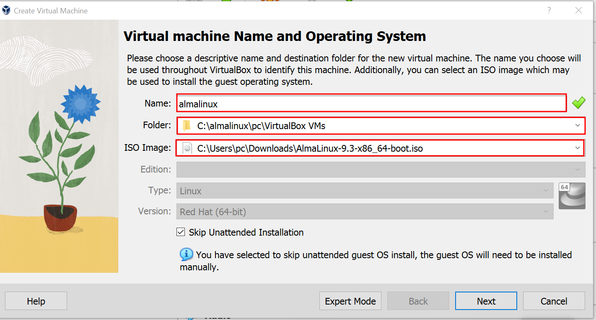
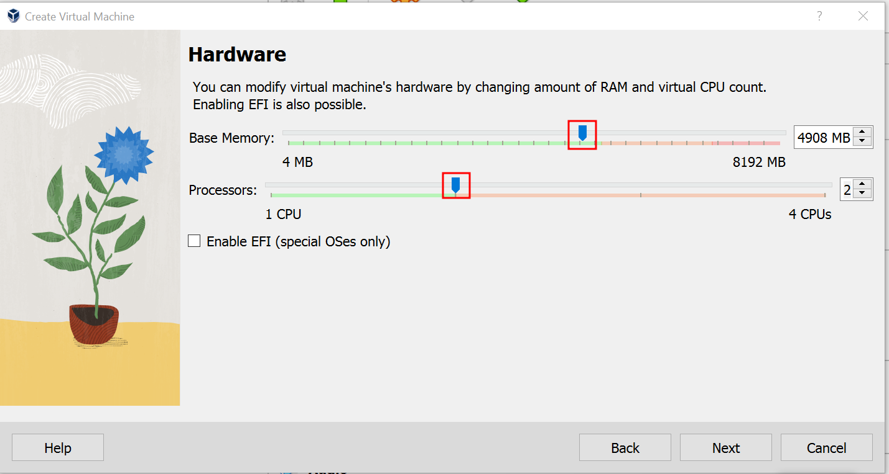
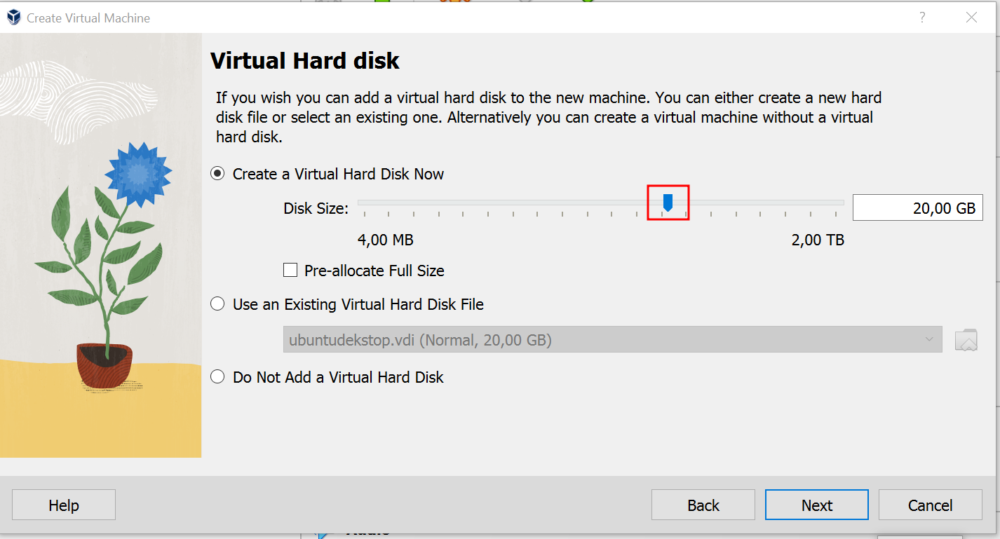

# install-almalinux
setelah membuka virtual box klik `NEW` selanjutnya isi `Name `folder dan `iso image masukkan file almalinux yang sudah di download

atur `base memory `processors dan klil next

atur `disk size

