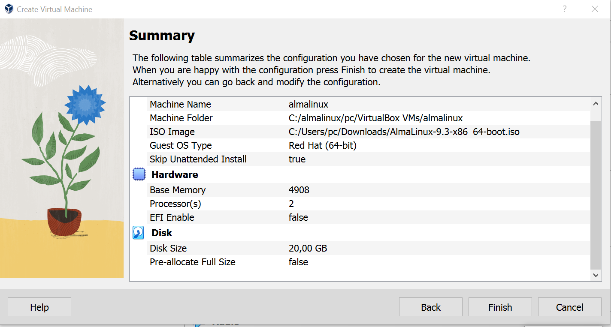
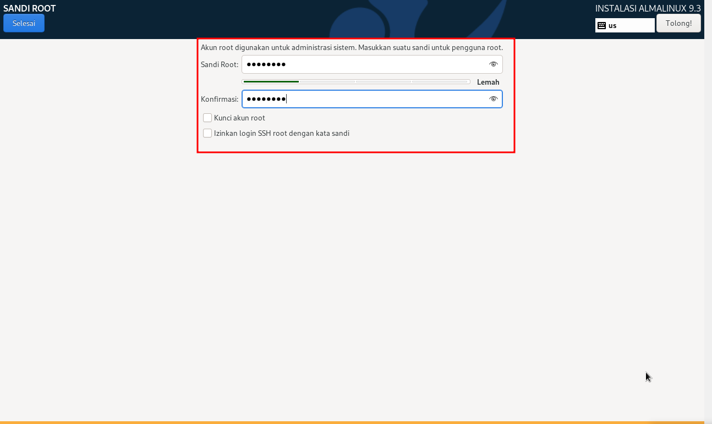
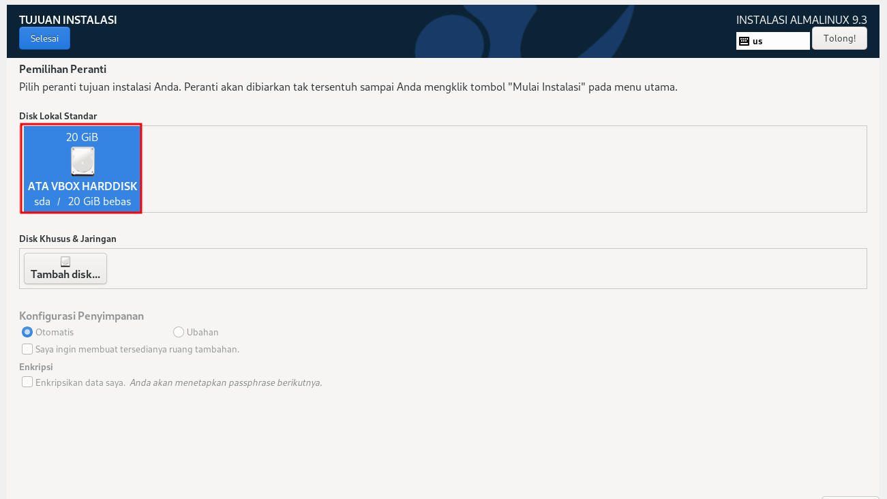
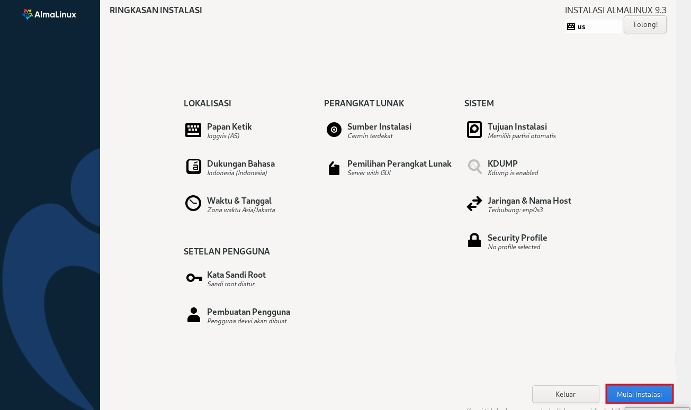

# install-almalinux
setelah membuka virtual box klik `NEW` selanjutnya isi `Name `folder dan `iso image masukkan file almalinux yang sudah di download

atur `base memory, `processors dan klik `next

atur `disk size

klik `finish

klik `Start

Atur bahasa yang akan di gunakan

lanjut untuk membuat `kata sandi root, pengguna, dan tujuan instalasi

klik `mulai instalasi

